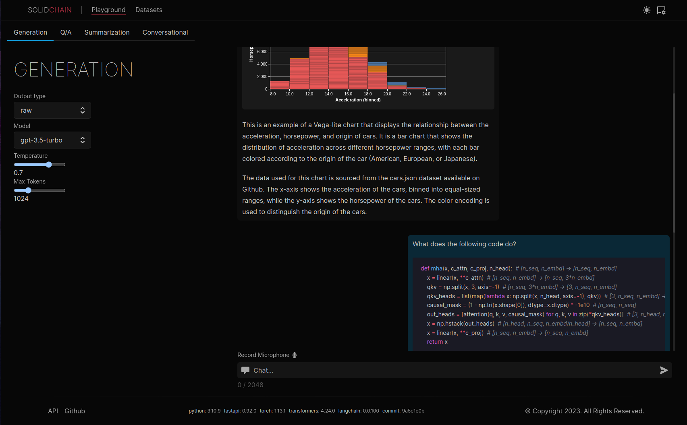

# Solidchain

> Caution: currently this is just a small testbed, and should not be used or taken for a real app/reference.

This is a web-based browser interface for searching with Large Language Models (LLMs). Built with [SolidJS](https://www.solidjs.com/) and [LangChain](https://langchain.readthedocs.io/en/latest/), it allows you to index a collection of documents (such as markdown files, PDFs, webpages, chat logs, etc.) and search using a dialogue based Q/A with natural language. Methods such as chain of thought (CoT) reasoning, and agent based reasoning (e.g. MRKL & ReAct) can be used depending on the use case.

|  |  |
| :-------------------------------------------------: | :-------------------------------------------------------: |
|                                                     |      |

## Installation

This application has two components, a frontend built with [SolidStart](https://start.solidjs.com/getting-started/what-is-solidstart), and an api layer built with [FastAPI](https://fastapi.tiangolo.com/) and [LangChain](https://langchain.readthedocs.io/en/latest/).

### Web

To run the webapp:

```sh
cd apps/web
pnpm install
pnpm dev
```

### API

To run the api, first create a virtual environment. We provide a sample `environment.yml` file to use with conda environments:

```sh
cd apps/api
conda create -f environment.yml
conda activate -n solidchain
```

Now run the api (in dev) with:

```sh
uvicorn src.solidchain.main:app --host ::1 --port 8000 --reload
```

The documentation (OpenAPI) can be found at `localhost:8000/docs`.

To run the initial database migration (initializing your database), run:

```sh
alembic upgrade head
```

In development, when creating changes to the schema, create a new migration with:

```sh
alembic revision --autogenerate -m "Add column X and index Y to model Z"
```

### Deployment

We provide a sample `docker-compose.yml` file in the root of the project. You can use this by running:

```sh
docker-compose up
```

This runs a local (postgres) database with a volume `postges-data`, as well as the pgadmin4 UI. In order to setup a connection, go to `localhost:5050/pgadmin4` and register a server. The local defaults (for convenience) are:

```
DATABASE=postgres
USERNAME=postgres
PASSWORD=postgres
PORT=5432
```

The host (locally) can be found by running:

```sh
docker inspect CONTAINER_ID  | grep IPAddress.
```

### TODO

Possible extensions

-   allow for local inference: e.g. flexgen
    -   llama/opt
-   web extension:
    -   capture users clipboard/current page as context
    -   extension bookmarking (upload html page to collection)
-   discord extension
-   visualization
    -   charting (e.g. vega-lite grammar)
    -   stable diffusion (image generation toolkit + auto prompt engineering)
    -   llm call visualization (tracing)
-   starter examples (email, mermaid graphs, terminal autocompletion)
